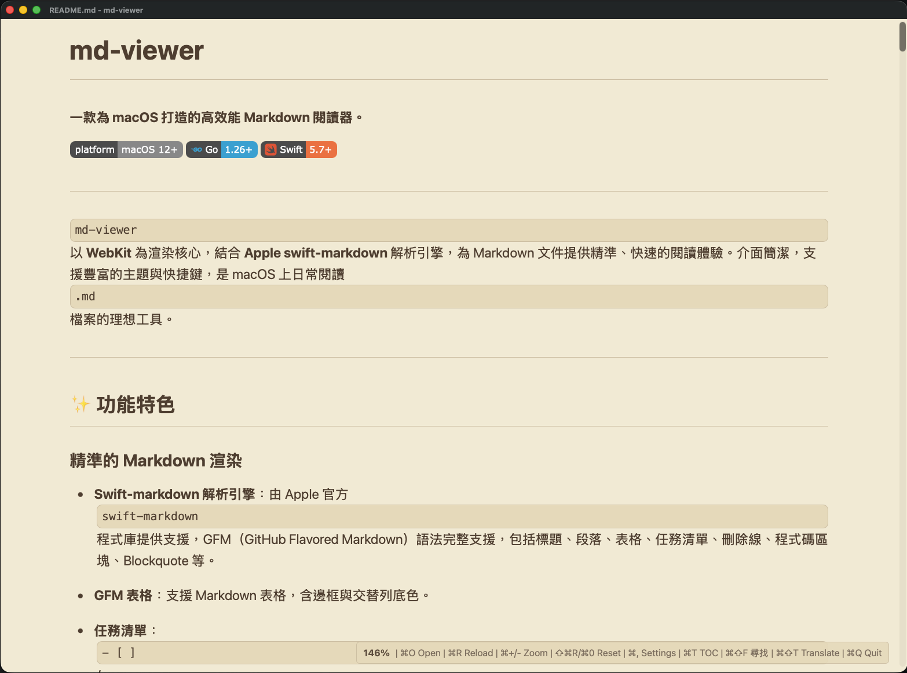

# md-viewer

**一款為 macOS 打造的高效能 Markdown 閱讀器。**

[](https://www.apple.com/macos)
[](https://go.dev)
[](https://swift.org)

---

`md-viewer` 以 **WebKit** 為渲染核心，結合 **Apple swift-markdown** 解析引擎，為 Markdown 文件提供精準、快速的閱讀體驗。介面簡潔，支援豐富的主題與快捷鍵，是 macOS 上日常閱讀 `.md` 檔案的理想工具。


---

## ✨ 功能特色

### 精準的 Markdown 渲染
- **Swift-markdown 解析引擎**：由 Apple 官方 `swift-markdown` 程式庫提供支援，GFM（GitHub Flavored Markdown）語法完整支援，包括標題、段落、表格、任務清單、刪除線、程式碼區塊、Blockquote 等。
- **GFM 表格**：支援 Markdown 表格，含邊框與交替列底色。
- **任務清單**：`- [ ]` / `- [x]` 語法直接渲染為可見的核取方塊。

### 程式碼體驗
- **語法高亮**：整合 highlight.js，支援 190+ 種語言的即時著色。
- **一鍵複製**：滑鼠移過程式碼區塊，右上角浮現複製按鈕，點擊即可複製內容。
- **行號顯示**：可在設定面板開關程式碼行號。

### 數學公式渲染
- **KaTeX 引擎**：透過 KaTeX（CDN）即時渲染 LaTeX 數學表達式，相較 MathJax 載入更快。
- **行內數學**：使用 `$...$` 語法，渲染為內嵌於段落的數學公式，如 $E=mc^2$、$\int_0^\infty e^{-x^2}dx$。
- **區塊數學**：使用 `$$...$$` 語法，渲染為獨立的 display 數學區塊，如馬克士威方程式、矩陣運算等。
- **複雜公式支援**：積分、極限、矩陣、希爾伯特空間、對齊方程组等多行公式皆可正確渲染。
- **淺色/深色主題自動適配**：KaTeX CSS 會跟隨當前主題自動調整。

### Mermaid 圖表
- **Mermaid.js 引擎**：整合 Mermaid v10.9.6（CDN），支援在 Markdown 中嵌入圖表。
- **支援的圖表類型**：
  | 類型 | 語法 | 狀態 |
  |------|------|------|
  | 流程圖 | `flowchart` | ✅ |
  | 序列圖 | `sequenceDiagram` | ✅ |
  | 圓餅圖 | `pie` | ✅ |
  | 甘特圖 | `gantt` | ✅ |
  | 類圖 | `classDiagram` | ✅ |
  | 狀態圖 | `stateDiagram-v2` | ✅ |
  | 使用者旅程圖 | `journey` | ✅ (定位偏移) |
  | 需求圖 | `requirementDiagram` | ✅ |
  | XY 圖表 | `xychart-beta` | ✅ |
- **語法**：使用 ` ```mermaid ` code block 即可自動渲染為圖表。
- **深色主題自動適配**：mermaid 主題會跟隨 data-theme 自動切換淺色/深色。
- **主題切換支援**：切換佈景主題時會自動重新渲染所有圖表。

### 多元主題
- **6 種精心設計的主題**：
  | 主題 | 說明 |
  |------|------|
  | Auto | 自動跟隨 macOS 系統外觀（Light / Dark） |
  | GitHub Light | GitHub 官方淺色文件風格 |
  | GitHub Dark | GitHub 官方深色文件風格 |
  | Sepia | 羊皮紙護眼暖色調 |
  | Solarized | Solarized 極簡配色 |
  | Nord | 北歐極地冷色調 |
- **主題即時切換**：無需重啟，變更立即套用。
- **語法高亮同步**：淺色主題自動使用淺色高亮配色，深色主題則切換為深色配色。

### 設定面板
- **縮放控制**：支援 `⌘+` / `⌘-` 縮放（50%–200%），縮放靈敏度可自訂。
- **字型與大小**：可選擇字體與尺寸。
- **i18n**：完整支援繁體中文、簡體中文、English、日本語、한국어，選單文字同步切換。
- **所有設定自動儲存**，下次開啟自動還原。

### 檔案互動
- **拖放開啟**：直接將 `.md` 檔案拖入視窗即可開啟，視覺化放置區域提示。
- **檔案監控自動重載**：外部編輯器存檔後，視窗自動重新渲染，並帶有粉紅色閃爍邊框動畫提示。
- **相對路徑智慧解析**：本地圖片或連結可自動解析為正確路徑。
- **外部連結**：文件中的 URL 點擊後自動以預設瀏覽器開啟。

### macOS 原生整合
- **原生選單列**：標準 macOS NSMenu，含應用程式、檔案、檢視、說明選單。
- **完整快捷鍵**：⌘O 開檔、⌘R 重載、⌘+/- 縮放、⌘0 重置、⌘, 設定、⌘F 全螢幕、⌘Q 結束。
- **文件關聯**：支援 `.md`、`.markdown`、`.txt` 檔案關聯，Finder 雙擊即可用 md-viewer 開啟。
- **匯出功能**：支援匯出為獨立 HTML（含完整內嵌樣式）與 PDF（原生列印流程）。

### 翻譯功能
- **支援 4 種翻譯後端**：
  - **MyMemory（預設）**：免費，不需 API Key，每日 1000 字額度
  - **DeepL**：需設定 `DEEPL_API_KEY`，免費 tier 每月 50 萬字
  - **DeepLX**：使用 DeepLX 代理直接呼叫 DeepL 免費 API，無需 API Key
  - **LibreTranslate**：需設定 `LIBRETRANSLATE_API_KEY`，可搭配自架實例
- **翻譯面板**：`⌘⇧T` 喚出，選擇來源語言與目標語言，點擊「開始翻譯」
- **行保留**：翻譯時保留 Markdown 格式（標題 `#`、程式碼區塊 \`\`\`、`內聯程式碼）
- **設定後端**：環境變數 `TRANSLATE_BACKEND`（預設值：`mymemory`）

### LibreTranslate 自架指南

#### 方式一：Docker（推薦）

**1. 安裝 Docker**

```bash
#  確認 Docker 已安裝
docker --version
```

**2. 啟動 LibreTranslate 容器**

```bash
docker run -d --name libretranslate \
  -p 5000:5000 -e TZ=Asia/Taipei \
  libretranslate/libretranslate
```

**3. 取得 API Key**

```bash
# 查詢預設 API Key（可自行修改）
docker exec libretranslate cat /usr/local/lib/python3.12/site-packages/libretranslate/lexilang/lexilang.en.json | head -1
# 或進入容器產生新 Key
docker exec -it libretranslate libretranslate generate-fipse-key
```

**4. 設定環境變數並啟動 md-viewer**

```bash
export TRANSLATE_BACKEND="libretranslate"
export LIBRETRANSLATE_API_KEY="your-api-key-here"
export LIBRETRANSLATE_URL="http://localhost:5000"
./md-viewer.app/Contents/MacOS/md-viewer
```

#### 方式二：Python 直接安裝

**1. 確認 Python 版本**

```bash
python3 --version  # 需要 3.8+
```

**2. 安裝 LibreTranslate**

```bash
pip3 install libretranslate
```

**3. 下載語言模型**

```bash
# 必要模型（以英<->中為例）
libretranslate get_argos-translate
```

**4. 啟動服務**

```bash
# 前台執行
libretranslate --host 0.0.0.0 --port 5000

# 或背景執行
nohup libretranslate --host 0.0.0.0 --port 5000 > /tmp/libretranslate.log 2>&1 &
```

**5. 產生 API Key（可選）**

```bash
libretranslate generate-fipse-key
```

**6. 設定環境變數並啟動 md-viewer**

```bash
export TRANSLATE_BACKEND="libretranslate"
export LIBRETRANSLATE_API_KEY="your-api-key-here"
export LIBRETRANSLATE_URL="http://localhost:5000"
./md-viewer.app/Contents/MacOS/md-viewer
```

#### 翻譯後端設定對照表

| 環境變數 | 說明 | 預設值 |
|----------|------|--------|
| `TRANSLATE_BACKEND` | 翻譯後端：`mymemory`、`deepl`、`deeplx`、`libretranslate` | `mymemory` |
| `LIBRETRANSLATE_API_KEY` | LibreTranslate API Key | 無 |
| `LIBRETRANSLATE_URL` | LibreTranslate 服務網址 | `http://localhost:5000` |
| `DEEPL_API_KEY` | DeepL API Key | 無 |
| `DEEPLX_URL` | DeepLX 服務網址 | `http://localhost:1188` |

#### 常用 Dockerfile 參數（進階）

```bash
# 啟動時指定 API Key（安全性較低，僅供測試）
docker run -d \
  --name libretranslate \
  -p 5000:5000 \
  -e LT_API_KEY="your-api-key" \
  -e TZ=Asia/Taipei \
  libretranslate/libretranslate

# 限制翻譯語言以節省記憶體
docker run -d \
  --name libretranslate \
  -p 5000:5000 \
  -e LOAD_DICTIONARIES="en_zh,zh_en,en_ja,ja_en,en_ko,ko_en" \
  libretranslate/libretranslate
```

#### 疑難排解

**Q: 翻譯請求逾時**
- 確認 LibreTranslate 服務正常：`curl http://localhost:5000/`
- 檢查防火牆設定，確認 port 5000 可連線

**Q: 翻譯結果為空**
- 確認已下載對應語言的翻譯模型
- 檢查 API Key 是否正確：`docker logs libretranslate`

**Q: 記憶體不足**
- Docker 方式建議至少 2GB RAM
- 可透過 `LOAD_DICTIONARIES` 限制載入語言數量

### DeepLX（DeepL 免費代理）自架指南

DeepLX 是一個開源的 DeepL API 代理，可將請求轉發至 DeepL 免費 API，適合不想註冊 DeepL 帳號但需要高品質翻譯的用戶。**使用 DeepLX 免費 API 完全不需要任何 API Key。**

#### Docker 部署

**1. 確認 Docker 已安裝**

```bash
docker --version
```

**2. 部署 DeepLX 容器**

```bash
docker run -d --name deeplx \
  -p 1188:1188 --restart unless-stopped \
  missuo/deeplx:latest
```

**3. 驗證服務**

```bash
# 本地測試翻譯（無需 API Key）
curl -X POST http://localhost:1188/translate \
  -H "Content-Type: application/json" \
  -d '{"text": "Hello World", "source_lang": "EN", "target_lang": "ZH"}'
```

正常應返回翻譯結果。

**4. 設定環境變數並啟動 md-viewer**

```bash
export TRANSLATE_BACKEND="deeplx"
export DEEPLX_URL="http://localhost:1188"
./md-viewer.app/Contents/MacOS/md-viewer
```

#### DeepLX 環境變數

| 環境變數 | 說明 | 預設值 |
|----------|------|--------|
| `DEEPLX_TARGET_LANG` | 預設目標語言 | `ZH` |
| `DEEPLX_SOURCE_LANG` | 預設來源語言 | `AUTO` |
| `DEEPLX_USE_FREE_API` | 使用免費 API（始終為 `true`） | `true` |
| `DEEPLX_AUTH_KEY` | DeepL Pro API Key（僅 Pro 需要） | 無 |

> **注意**：DeepLX 預設使用 `DEEPLX_USE_FREE_API=true`，直接呼叫 `api-free.deepl.com`，完全不需要 API Key。若有 Pro API Key 可設定 `DEEPLX_AUTH_KEY` 以提升頻寬限額。

#### Docker 完整設定範例

```bash
# 基本版（免費 API，無需 Key）
docker run -d --name deeplx -p 1188:1188 -e DEEPLX_TARGET_LANG=ZH -e TZ=Asia/Taipei \
  --restart unless-stopped missuo/deeplx:latest

# 指定預設翻譯語言對
docker run -d --name deeplx -p 1188:1188 \
  -e DEEPLX_TARGET_LANG=ZH -e DEEPLX_SOURCE_LANG=EN \
  --restart unless-stopped missuo/deeplx:latest

# 使用 Pro API Key（提升頻寬）
docker run -d --name deeplx -p 1188:1188 \
  -e DEEPLX_AUTH_KEY="your-auth-key:your-auth-key" -e DEEPLX_USE_FREE_API=false \
  --restart unless-stopped missuo/deeplx:latest
```

#### md-viewer 翻譯後端設定

```bash
export TRANSLATE_BACKEND="deeplx"
export DEEPLX_URL="http://localhost:1188"
./md-viewer.app/Contents/MacOS/md-viewer
```

#### 翻譯後端完整對照表

| 後端 | 環境變數 | 說明 |
|------|----------|------|
| `mymemory` | （無） | 預設免費 API，每日 1000 字 |
| `deepl` | `DEEPL_API_KEY` | DeepL Pro API，需付費 |
| `deeplx` | `DEEPLX_URL` | DeepLX 代理，呼叫 DeepL 免費 API，無需 Key |
| `libretranslate` | `LIBRETRANSLATE_URL`, `LIBRETRANSLATE_API_KEY` | 自架翻譯引擎 |

#### 疑難排解

**Q: 翻譯請求被拒絕（403/429）**
- DeepL 免費 API 有頻率限制，建議降低翻譯頻率或使用 Pro API
- 檢查 DeepLX 服務狀態：`curl http://localhost:1188/`

**Q: Docker 容器啟動失敗**

```bash
# 查看錯誤日誌
docker logs deeplx

# 確認 port 未被佔用
lsof -i :1188
```

**Q: 提高翻譯穩定性**

```bash
# 設定超時與重試次數
docker run -d --name deeplx -p 1188:1188 \
  -e DEEPLX_TIMEOUT=30 -e DEEPLX_RETRY=3 \
  --restart unless-stopped missuo/deeplx:latest
```

---

## ⌨️ 快捷鍵

| 功能 | 快捷鍵 |
|:---|:---|
| 開啟檔案 | `⌘O` |
| 重新載入 | `⌘R` |
| 放大 | `⌘+` 或 `⌘=` |
| 縮小 | `⌘-` |
| 重置縮放 | `⌘0` 或 `⇧⌘R` |
| 設定面板 | `⌘,` |
| 全螢幕 | `⌘F` |
| 匯出 HTML | `⌘⇧E` |
| 匯出 PDF | `⌘⇧P` |
| 翻譯面板 | `⌘⇧T` |
| 結束程式 | `⌘Q` |

> **Trackpad 手勢**：`Ctrl` + 雙指滾動同樣支援縮放。

---
## 安裝方法

### 方法一：Homebrew
```bash
brew tap openclawchen8-lgtm/tap
brew install --cask md-viewer
```

### 方法二：手動下載
從 [Releases](https://github.com/openclawchen8-lgtm/md-viewer-webview/releases) 下載 DMG。

安裝後若出現「已損毀」提示，在終端機執行：
```bash
xattr -cr /Applications/md-viewer.app
```

## 📦 執行方式

### 方式一：直接使用（推薦）

```bash
# 複製 App bundle
cp -r ./md-viewer.app /Applications/

# 設定為 .md 檔案的預設開啟程式
# 對任意 .md 檔案按右鍵 → 開啟方式 → 選擇 md-viewer → 點選「全部替換」
```

### 方式二：命令列執行

```bash
./md-viewer.app/Contents/MacOS/md-viewer           # 開啟空視窗
./md-viewer.app/Contents/MacOS/md-viewer readme.md  # 直接開啟指定檔案
```


---

## 🔨 從原始碼編譯

### 環境需求

| 工具 | 最低版本 |
|------|----------|
| macOS | 12.0+ (Monterey) |
| Go | 1.26+ |
| Swift | 5.7+ |
| Xcode Command Line Tools | 已安裝 |

### 編譯步驟

```bash
git clone https://github.com/openclawchen8-lgtm/openclaw-tasks.git
cd openclaw-tasks/md-viewer-webview

# 一次性編譯 + 打包
./build.sh
```

`build.sh` 會依序執行：
1. `go mod tidy` — 整理 Go 依賴
2. `swift build -c release` — 編譯 Swift MarkdownEngine → `libMarkdownEngine.dylib`
3. `go build -o md-viewer` — 編譯 Go 主程式（含 CGO）
4. 建立 `md-viewer.app/` bundle 結構
5. 由 `Info.plist.template` 產生 `Contents/Info.plist`（**版本號**由腳本帶入，見下）
6. 複製 Swift dylib → `Contents/Frameworks/`
7. 修正 `@rpath` 以確保動態連結正確

### 版本號與「關於 md-viewer」

選單列 **關於 md-viewer**（或 **說明 → 關於**）所顯示的版本，來自 app bundle 內的 `Info.plist`。請以 **`./build.sh`** 打包，才會把最新版本寫入 bundle。

| 項目 | 設定方式 |
|------|----------|
| **CFBundleShortVersionString**（對外版本，例如 `1.0.0`） | 編輯 **`build.sh`** 中的 `MARKETING_VERSION`（預設值在腳本開頭）。單次覆寫：`MARKETING_VERSION=1.0.0 ./build.sh`。 |
| **CFBundleVersion**（建置序號） | **自動遞增**：每次 `swift build` 與 `go build` **皆成功後**，腳本會將專案根目錄的 **`.build_number`** 加一並寫回，再填入 plist。編譯失敗不會跳號。新 clone 若無此檔，會從 `1` 開始。 |
| **版權、bundle id、文件關聯等** | 編輯 **`Info.plist.template`**。模板裡的 `__MARKETING_VERSION__`、`__BUILD_NUMBER__` 由 `build.sh` 替換，請勿手動改成固定數字。 |

**建議**：團隊共用同一建置序號時，將 **`.build_number`** 一併提交版控；若希望每人本機各自累加，可改將該檔加入 `.gitignore`。

僅執行 `go build` 產生的裸二進位 **`./md-viewer`** 時，系統可能無法載入 bundle 的 `Info.plist`，About 會顯示開發用後備字樣。若要看到正確版本，請在執行 **`./build.sh`** 後使用 **`open md-viewer.app`**。

---

## 🏗 技術架構

```
┌─────────────────────────────────────────────┐
│                 macOS App                    │
│                                              │
│  ┌────────────────────────────────────────┐ │
│  │            webview_go (WKWebView)       │ │
│  │   HTML Template + CSS + JavaScript      │ │
│  │   • 主題切換  • 縮放  • i18n           │ │
│  │   • 程式碼高亮  • 複製按鈕             │ │
│  └──────────────┬───────────────────────────┘ │
│                 │ JS Bindings                │
│  ┌──────────────▼───────────────────────────┐ │
│  │         main.go (Go)                     │ │
│  │   • 設定持久化  • NSMenu 回调           │ │
│  │   • 檔案監控  • 匯出邏輯                │ │
│  └──────────────┬───────────────────────────┘ │
│                 │ CGO FFI                     │
│  ┌──────────────▼───────────────────────────┐ │
│  │     core/renderer.go → libMarkdownEngine │ │
│  │            (C shared library)             │ │
│  └──────────────┬───────────────────────────┘ │
│                 │ Swift C Export               │
│  ┌──────────────▼───────────────────────────┐ │
│  │  Sources/MarkdownEngine/Engine.swift     │ │
│  │       swift-markdown (AST → HTML)        │ │
│  └──────────────────────────────────────────┘ │
└─────────────────────────────────────────────┘
```

### 核心技術棧

| 層級 | 技術 |
|------|------|
| 渲染引擎 | WebKit（WKWebView via webview_go） |
| Markdown 解析 | swift-markdown（Apple 官方） |
| UI 樣式 | GitHub 風格 CSS 變數 + highlight.js |
| 原生功能 | CGO + Objective-C（NSMenu、Drag&Drop、PDF Export） |
| 設定儲存 | JSON 檔案（`~/.md-viewer/config.json`） |
| 檔案監控 | Go fsnotify |

---

## 🔌 設定檔

設定儲存於 `~/.md-viewer/config.json`，手動編輯亦可：

```json
{
  "zoomSensitivity": 5,
  "theme": "auto",
  "zoomLevel": 1.0,
  "fontFamily": "-apple-system, BlinkMacSystemFont, ...",
  "fontSize": 16,
  "language": "zhTW",
  "showLineNumbers": false
}
```

---

## ❓ 常見問題

**Q: 為什麼使用 Swift-markdown 而非純 Go 方案？**
Apple 的 `swift-markdown` 解析品質極高，GFM 語法支援完整，與 macOS 原生整合緊密，適合作為 macOS 專屬閱讀器的核心。

**Q: 可以跨平台嗎？**
目前僅支援 macOS。若需 Linux/Windows 版本，可將 Swift-markdown 替換為 goldmark（純 Go），但渲染品質會有所差異。

**Q: .md 檔案關聯失效怎麼辦？**
執行 `open -a md-viewer.app` 一次，macOS 會重新註冊文件類型。

---

## 📄 授權

本專案為個人學習與使用目的建立。
