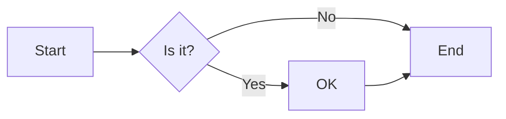
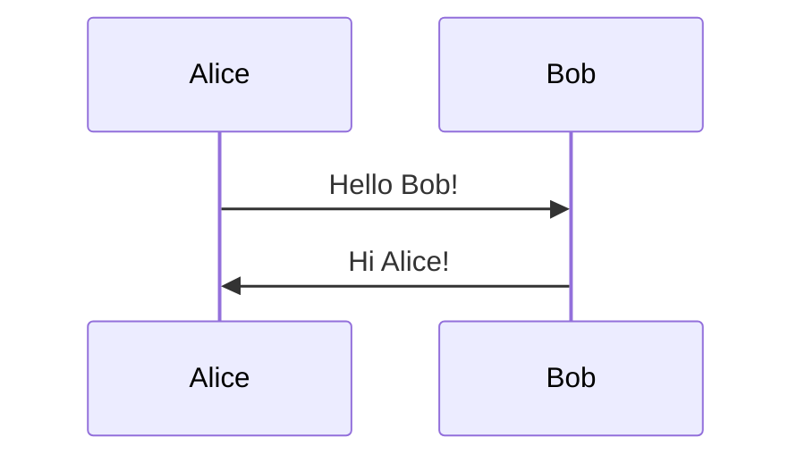
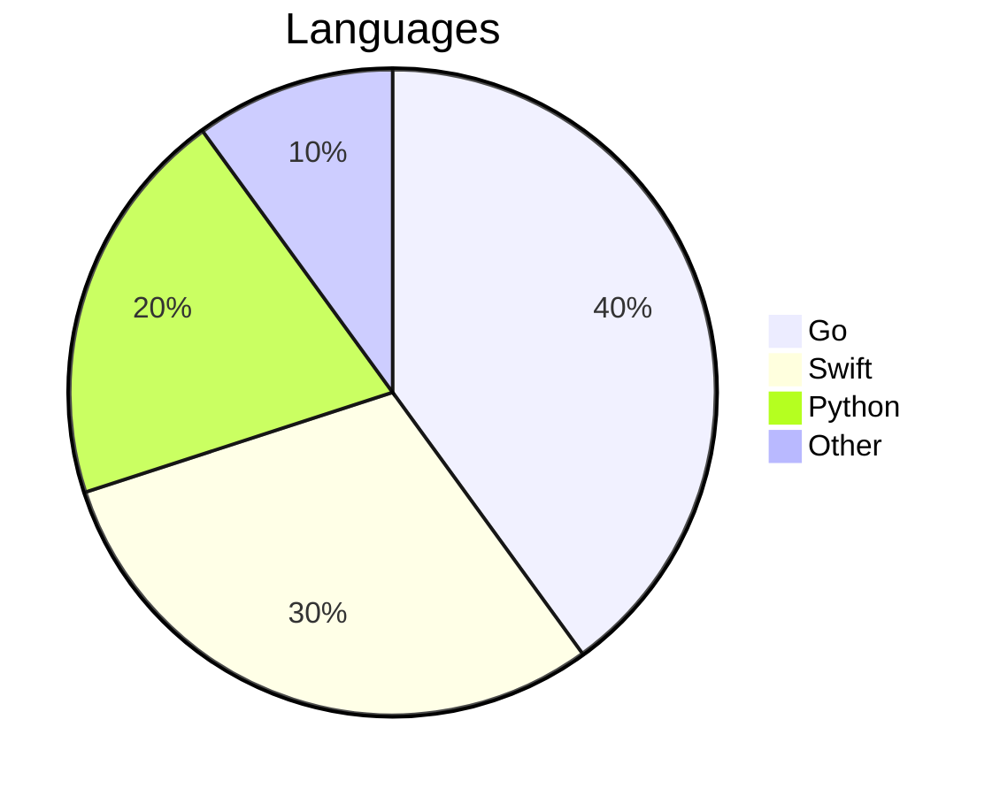
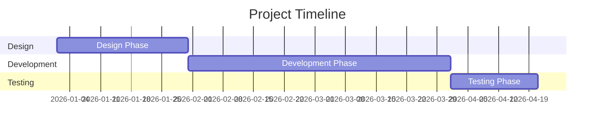
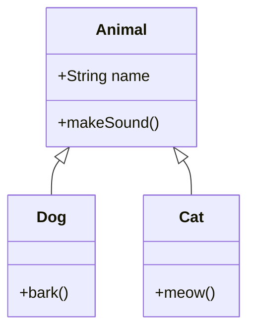
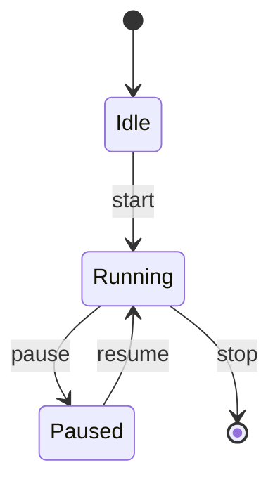
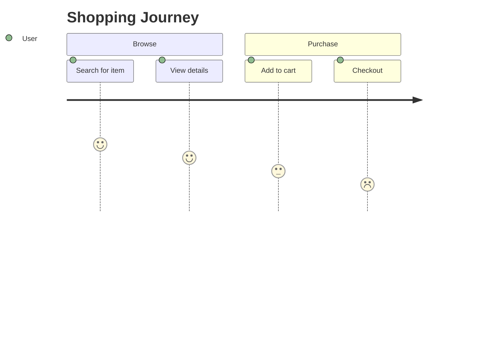
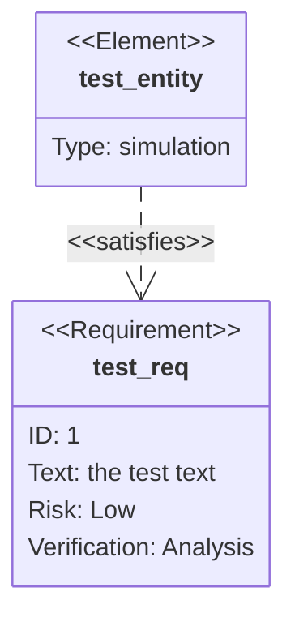
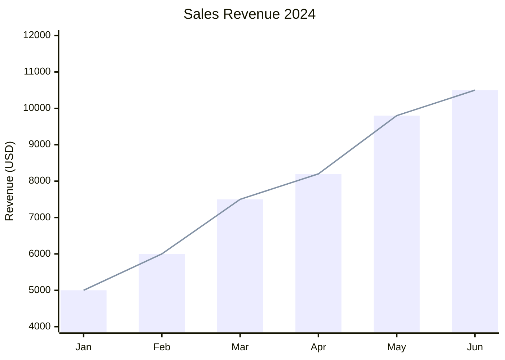
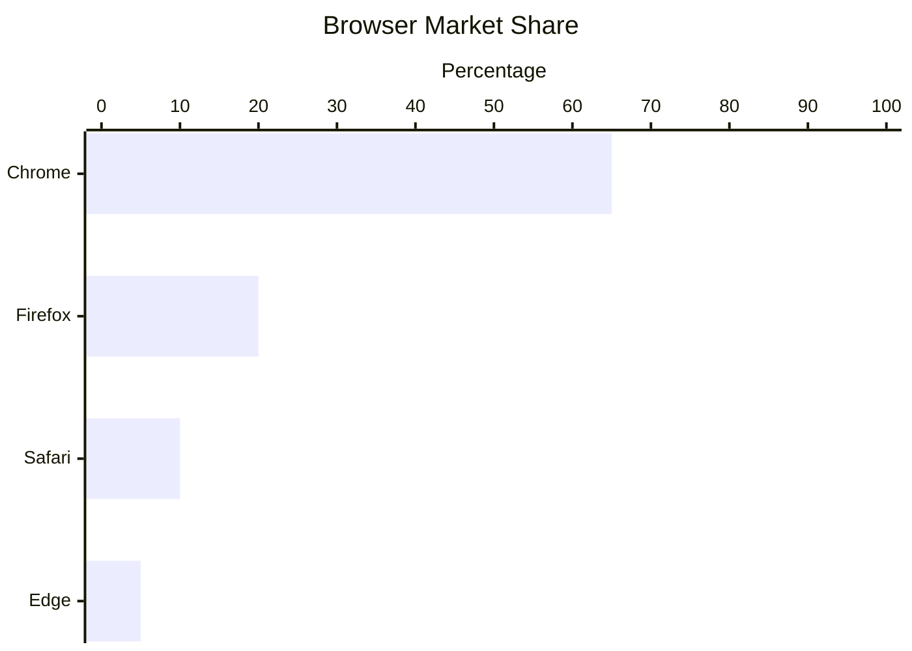

# Mermaid 圖表測試

## 流程圖 (Flowchart)

## 序列圖 (Sequence Diagram)

## 圓餅圖 (Pie Chart)

## 甘特圖 (Gantt Chart)

## 類圖 (Class Diagram)

## 狀態圖 (State Diagram)

## 使用者旅程圖 (User Journey)

## 需求圖 (Requirement Diagram)

## XY 圖表 (XY Chart)

## XY 圖表 (水平)

