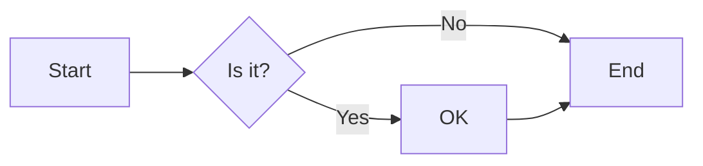
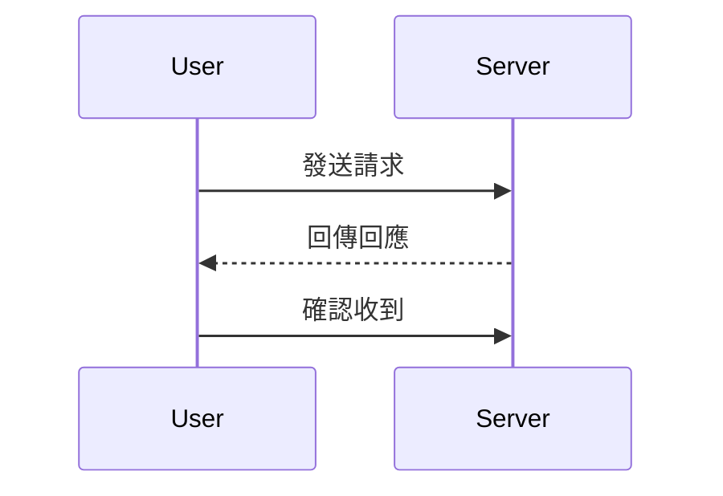
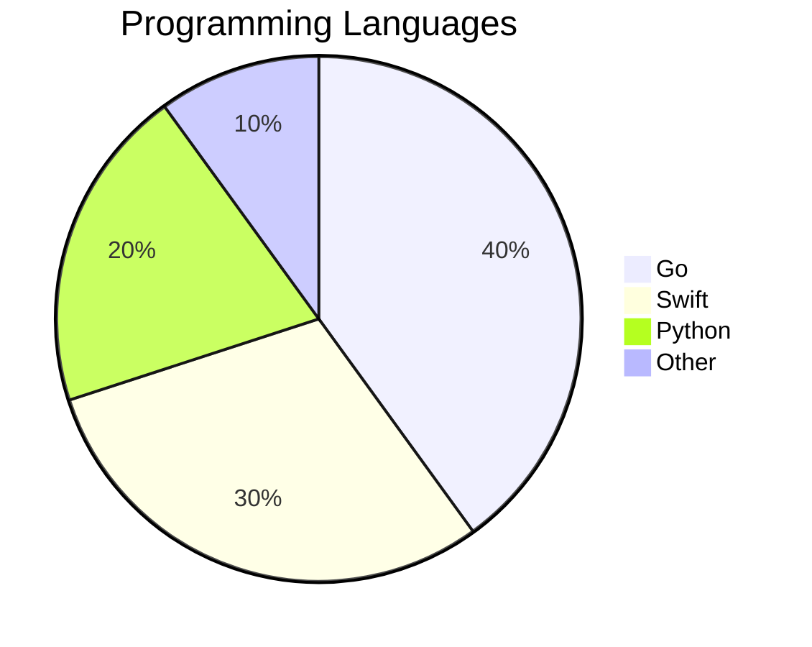
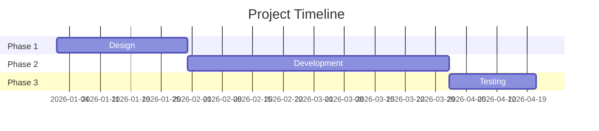
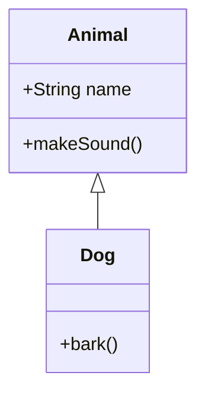
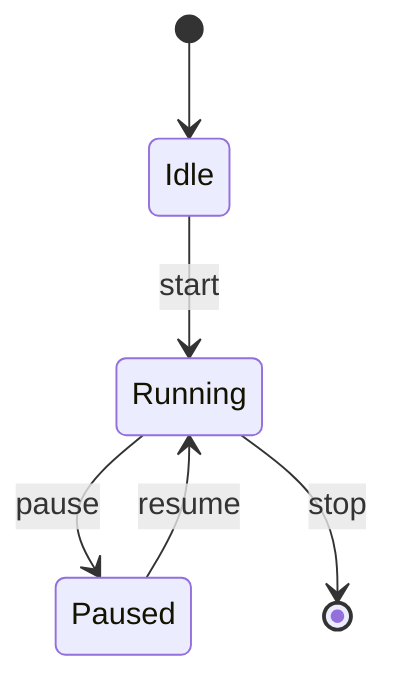
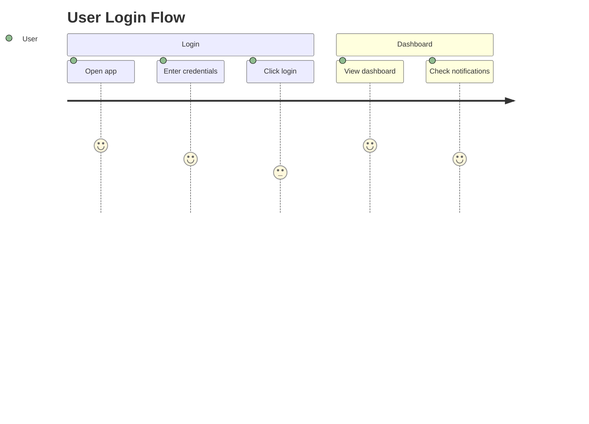
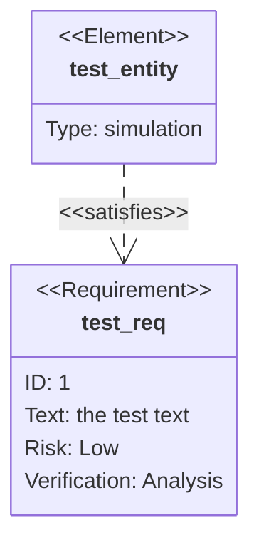
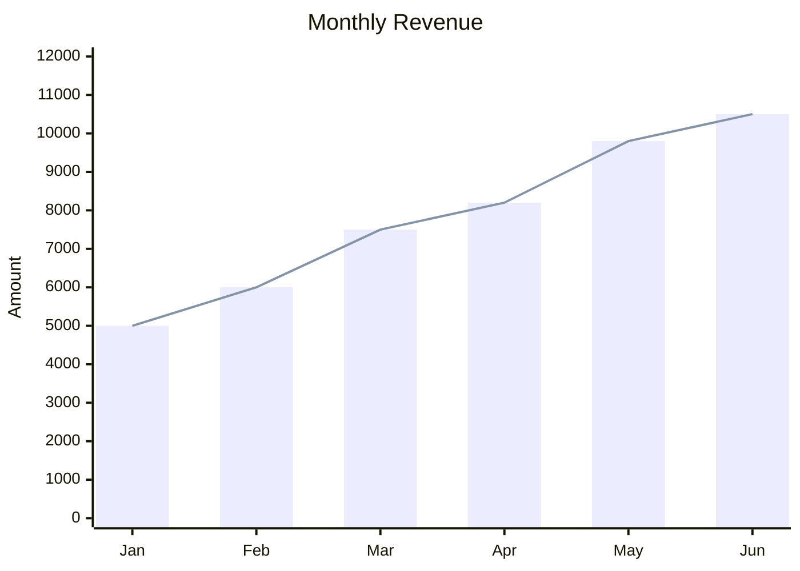
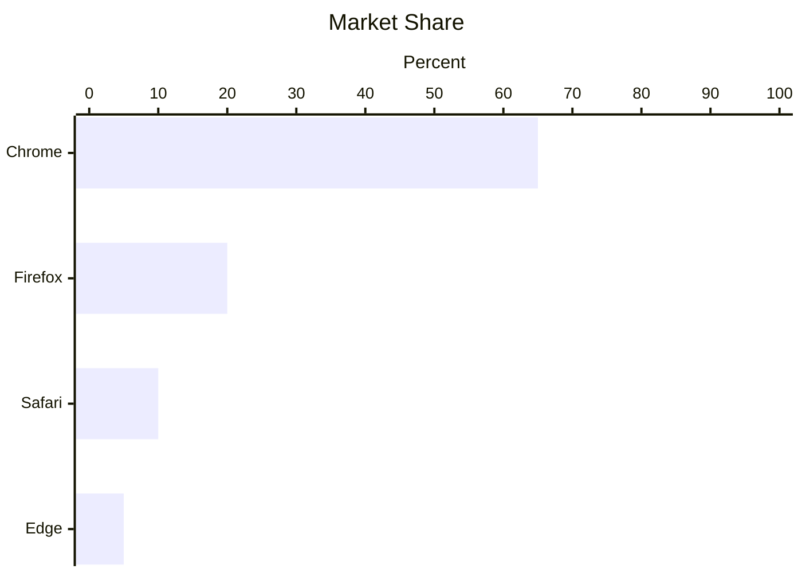

# md-viewer 功能總測試

> 此檔案涵蓋 md-viewer 所有已支援功能的驗證。
> 測試日期：2026-05-12

---

## 1. 標題層級 (Headings)

# H1 標題
## H2 標題
### H3 標題
#### H4 標題
##### H5 標題
###### H6 標題

---

## 2. 文字格式 (Text Formatting)

**粗體文字** | *斜體文字* | ~~刪除線~~ | `行內程式碼` | **粗體 *混合* 格式**

### 超連結

- [外部連結 — GitHub](https://github.com)
- [內部錨點 — 回到頂部](#md-viewer-功能總測試)

### 圖片


### 引用 (Blockquote)

> 這是區塊引用。
>
> > 巢狀引用。
>
> — 引用來源

### 水平線

以上是分割線。

---

## 3. 列表 (Lists)

### 無序列表

- 項目一
- 項目二
  - 子項目 A
  - 子項目 B
- 項目三

### 有序列表

1. 第一步
2. 第二步
   1. 子步驟 a
   2. 子步驟 b
3. 第三步

### 任務清單 (Task List)

- [x] 已完成任務
- [ ] 未完成任務
- [x] 支援快捷鍵
- [ ] 待實作功能

---

## 4. 表格 (Tables)

### 基本表格

| 功能 | 狀態 | 備註 |
|------|------|------|
| 標題渲染 | ✅ | h1-h6 |
| 數學公式 | ✅ | KaTeX |
| Mermaid 圖表 | ✅ | 9/10 類型 |

### 對齊表格

| 靠左 | 置中 | 靠右 |
|:-----|:----:|-----:|
| 文字 | 文字 | 文字 |
| 123  | 456  | 789  |

---

## 5. 程式碼區塊 (Code Blocks)

### Go

```go
package main

import "fmt"

func main() {
    for i := 0; i < 10; i++ {
        fmt.Printf("Hello, World! (%d)\n", i)
    }
}
```

### Swift

```swift
import Foundation

struct User: Codable, Identifiable {
    let id: UUID
    var name: String
    var email: String
}

let users = try JSONDecoder().decode([User].self, from: data)
```

### Python

```python
def fibonacci(n: int) -> int:
    if n <= 1:
        return n
    return fibonacci(n - 1) + fibonacci(n - 2)

print([fibonacci(i) for i in range(10)])
```

### JavaScript

```javascript
const debounce = (fn, delay) => {
  let timer;
  return (...args) => {
    clearTimeout(timer);
    timer = setTimeout(() => fn(...args), delay);
  };
};
```

### 行內程式碼

執行 `go build -o md-viewer` 編譯，然後執行 `./md-viewer file.md`。

---

## 6. 數學公式 (KaTeX)

### 行內數學

質能方程式：$E = mc^2$

歐拉公式：$e^{i\pi} + 1 = 0$

二次公式：$x = \frac{-b \pm \sqrt{b^2 - 4ac}}{2a}$

### 區塊數學

#### 麥克斯韋方程組

$$\nabla \cdot \mathbf{E} = \frac{\rho}{\varepsilon_0}$$

$$\nabla \times \mathbf{E} = -\frac{\partial \mathbf{B}}{\partial t}$$

#### 積分

$$\int_{0}^{\infty} x^2 e^{-x^2} dx = \frac{\sqrt{\pi}}{4}$$

#### 矩陣

$$\begin{pmatrix} a_{11} & a_{12} \\ a_{21} & a_{22} \end{pmatrix}^{-1} = \frac{1}{ad - bc} \begin{pmatrix} d & -b \\ -c & a \end{pmatrix}$$

#### 求和

$$\sum_{n=1}^{\infty} \frac{1}{n^2} = \frac{\pi^2}{6}$$

#### 極限

$$\lim_{x \to 0} \frac{\sin x}{x} = 1$$

#### 多行對齊

$$\begin{aligned}
\nabla \cdot \mathbf{E} &= \frac{\rho}{\varepsilon_0} \\
\nabla \cdot \mathbf{B} &= 0 \\
\nabla \times \mathbf{E} &= -\frac{\partial \mathbf{B}}{\partial t} \\
\nabla \times \mathbf{B} &= \mu_0 \mathbf{J} + \mu_0 \varepsilon_0 \frac{\partial \mathbf{E}}{\partial t}
\end{aligned}$$

#### 混合測試

區塊公式：
$$e^x = \sum_{n=0}^{\infty} \frac{x^n}{n!}$$

行內公式 $\int_a^b f(x)\,dx = F(b) - F(a)$ 接續文字。

#### 跳脫錢幣符號

價格：\$100（應顯示為 `$100`）

---

## 7. Mermaid 圖表

### 流程圖 (Flowchart)



### 序列圖 (Sequence Diagram)



### 圓餅圖 (Pie Chart)



### 甘特圖 (Gantt Chart)



### 類圖 (Class Diagram)



### 狀態圖 (State Diagram)



### 使用者旅程圖 (User Journey)



### 需求圖 (Requirement Diagram)



### XY 圖表 (XY Chart)



### XY 圖表 (水平)



---

## 8. 混合內容測試

這是一段包含**多種格式**的段落：行內數學 $y = mx + b$、`程式碼`、以及**粗體**。

> 引用內也可以有 **格式** 和 $a^2 + b^2 = c^2$。

| 混合 | 測試 |
|:----|:----:|
| $\pi r^2$ | 圓面積公式 |
| `npm install` | 安裝指令 |

```bash
echo "Hello from bash!"  # 語法高亮
for i in {1..5}; do
    echo "Count: $i"
done
```

---

## 9. 快捷鍵驗證備忘

| 快捷鍵 | 功能 |
|--------|------|
| ⌘O | 開啟檔案 |
| ⌘R | 重新載入 |
| ⌘+ / ⌘- | 縮放 |
| ⇧⌘R / ⌘0 | 重置縮放 |
| ⌘, | 設定 |
| ⌘T | 目錄 (TOC) |
| ⌘⇧F | 搜尋 |
| ⌘⇧T | 翻譯 |
| ⌘Q | 離開 |

---

*測試結束 — 所有功能驗證完成。*
